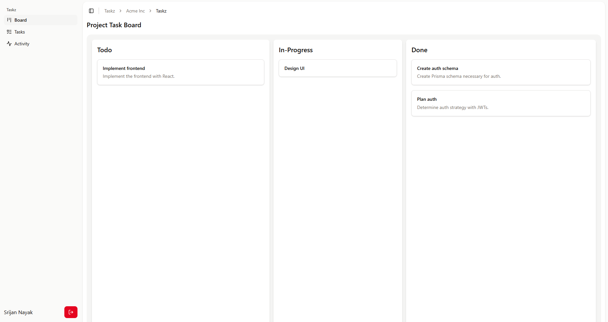

# Taskz

A multi-tenant application allowing users to manage projects in organizations, built with [Next.js 15](https://nextjs.org/).



## Features

### Organization management

- Create organizations
- Invite members to your organization (admins only)
- Track invitation status (admins only)
- View and manage memeber roles (admins only)
- View all organization-level activity

### Project management

- Create projects within an organization (admins only)
- Create tasks for projects
- View and manage status of each task
- View all project-level activity

## Running it locally

Clone and install dependencies.

```bash
git clone https://github.com/srijan-nayak/taskz.git
cd taskz
npm i
```

Setup a Postgres DB, for example with docker.

```bash
docker run -d \
  --name my-postgres \
  -e POSTGRES_USER=<username> \
  -e POSTGRES_PASSWORD=<password> \
  -e POSTGRES_DB=<database> \
  -p 5432:5432 \
  postgres:alpine
```

Setup a Setup `.env` file

```bash
DATABASE_URL="postgresql://<username>:<password>@localhost:5432/<database>"
PEPPER="<random-secret>"
SESSION_SECRET="<random-secret>"
```

Apply migrations to the database.

```bash
npx prisma migrate dev
```

Build and start the application.

```bash
npm run build
npm start
```

The application will now be running on [localhost:3000](http://localhost:3000).

## Auth strategy

Before storing credentials to the database after signup, passwords are combined with a server secret "pepper" and then hashed (with [bcrypt](https://www.npmjs.com/package/bcrypt)). This prevents hash-to-password lookup from rainbow tables, as the hash was not computed with the password directly. On login, the password input is again combined with the secret "pepper" before being compared with the stored hash.

For session management, JSON Web Tokens are signed with a server secret (with [Jose](https://www.npmjs.com/package/jose)), and stored in cookies. Each protected server action verifies the JWT (with other checks described in the next session) before proceeding and redirects the user to the login page (or the app home page depending on the context) if unauthenticated.

## Designing with multi-tenancy in mind

To allow support for different users accessing the app, with each having the ability to manage their own organizations, the following entitites were needed:

- **Users**
- **Organizations**
- **Membersips**: Links users to organizations. Also specifies each members role (Owner, Admin, Member).
- **Invitations**: Allows user to invite other users on the platform to their organizations. Keeps track of the status of the invite (Tentative, Accepted, Rejected).

Each server action validates, depending on the request context, validates the following:

- User has a valid session
- User belongs to the organization, a resource of which is being requested or modified
- User is an admin (or owner), if the action is supposed to be restricted to admins only
- If the resource is actually part of the current organization (or project in the organization)

## Activity feed

Each mutating action in an organization (and further in a project) is recorded (inside transactions) and visible in activity feeds. Users can view all activity at the organization level, or view only particular project level activities.
